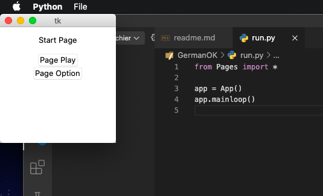
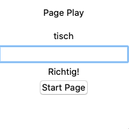
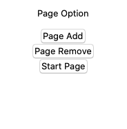
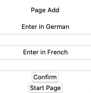
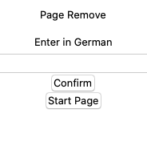

# GermanOK

GermanOK is a Python script that helps people to learn a foreign language.
The interface is purely in English and simple to use.

GermanOK is built like a little game that asks you to translate words. It store your score for each word to see your progression.
GermanOK allows you to add and remove words within the interface.

The interface is pretty small. The window can be opened on a corner of your screen and make a few games when bored.

## Idea

Make a interface which can stay opened on your screen without disturbing your work.
Sometimes you can play and guess a few words. You can also quickly add a new word that you hear right now!

## Installation

Use the package manager [pip](https://pip.pypa.io/en/stable/) to install the needed libraries.

```bash
python -m pip install tkinter
python -m pip install json
python -m pip install time
```

Theses libraries should already be installed with python.
With an actual version, you should not need to install the above libraries.

## Usage

```python
cd GermanOK
python3 run.py
```

The following interface should appear:


## Pages availables

      

## Contributing
Pull requests are welcome. For major changes, please open an issue first to discuss what you would like to change.

To contribute to GermanOK, follow these steps:

1. Fork this repository.
2. Create a branch: `git checkout -b <branch_name>`.
3. Make your changes and commit them: `git commit -m '<commit_message>'`
4. Push to the original branch: `git push origin <project_name>/<location>`
5. Create the pull request.

Alternatively see the GitHub documentation on [creating a pull request](https://help.github.com/en/github/collaborating-with-issues-and-pull-requests/creating-a-pull-request).

## Contact

If you want to contact me, you can reach me at romain.ledru2@gmail.com

### Next Steps!

Well, if you are still reading, that maybe means that you are interested in the project.

I want to continue updating GermanOK this way:

* Score are stored
    * The score will have an influence of the word appear frequency
    * For a well known word it would less appear
    * For a bad know word it would more often appear
* List well known words
    * Have a new page which describe the number of well known words and give maybe a level according to european regulation
* Make sentences
    * Words are great to know. But sentences would make more meaning and powerful learning
* Automatic correction
    * To see where the error was and why the error occurs

Feel free to propose new ideas! :smiley:
